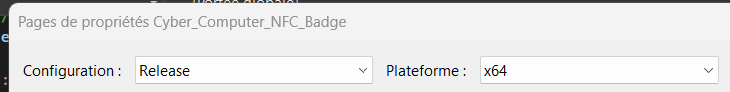

# CHIM HSM NFC

## Description
The CHIM HSM NFC NFC Badge program interfaces with the NFC Hardware Security Module from LoremIpsum. It facilitates the retrieval of key segments used for BitLocker encryption and supports key creation, as well as the ability to export or import backups of these keys. Key storage can be configured in two modes: using dual NFC cards or combining a single NFC card with the HSM's EEPROM.

## Building Instructions
The program must be built using the Visual Studio IDE.

### Preparation
Before building the project, refer to the README in the dependencies section to build the Crypto++ library. Return here upon completion.

### Solution Configuration
1. Open the solution file `Chim_Hsm_Nfc.sln`.
2. Ensure the configuration is set to `Release` and the platform to `x64`, as illustrated below:
   

### Project Properties Configuration
1. Navigate to `Project -> Properties` to access the properties pages. Edit the correct configuration: 
2. Under `C/C++ -> General`, add the following path to the "Additional Include Directories": C:\path\to\cloned\repo\Chim_Hsm_Nfc\dependencies
3. Under `C/C++ -> Code Generation`, set "Runtime Library" to Multi-threaded (/MT) to ensure static linking of libraries.

### Linker Settings
1. Under `Linker -> General`, add the following paths to "Additional Library Directories": 
    C:\Program Files (x86)\Windows Kits\10\Lib\10.0.22621.0\um\x64;C:\path\to\cloned\repo\Chim_Hsm_Nfc\dependencies\cryptopp\x64\Output\Release
2. Under `Linker -> Input`, add the following libraries to "Additional Dependencies": cryptlib.lib;gdi32.lib;user32.lib;comdlg32.lib;

These are necessary for the Crypto++ library and the user interface components.

### Building the Project
Build the application by pressing `Ctrl + B`, or navigate to `Build -> Build Chim_Hsm_Nfc`, or right-click on the project in the Solution Explorer and select "Build".

## Future implementations
- Display the entropy values of individual key segments and passwords, along with the overall entropy of the assembled key.
- Enhance serial port detection to accommodate variability in dev board connections across different machines. The program should scan available ports and select the appropriate one automatically, or display them and let the user decide on which to use.
- Add functionality to display and modify the default backup location based on user preferences.
- Include translations for all displayed text to support multiple languages.
- Add an automatic logout feature when the NFC card is removed from the reader.
- Customize the user interface with colors that match with the CHIM HSM NFC application.
- Integrate the application's icon directly into the executable.

## Fix to implement
- Exporting keys do not work when using default path.

## Notes
- The file "NFCReader.cpp" is the functional source code for the initial requirement. Which was to use an NFC card's ID as an encryption key.
